<div align="center">



<br><br>

**هر محصول، ارزش دیده شدن را دارد.**

با خلق تصاویر و محتوای حرفه‌ای، به برندها کمک می‌کنیم محصولات خود را شایسته‌تر معرفی کنند.

<br>


</div>

---

## درباره‌ی پروژه

**YP Product** یک وب‌سایت تک‌صفحه‌ای (Single Page) برای معرفی خدمات یه استودیوی عکاسی تبلیغاتیه.
با HTML، CSS و جاوااسکریپت خالص ساخته شده — بدون هیچ فریم‌ورک یا مرحله‌ی build، مستقیم روی
GitHub Pages یا هر هاست استاتیک دیگه‌ای قابل اجراست.

---

## ساختار صفحه

| بخش | توضیح |
|---|---|
| **هیرو** | لوگو، شعار برند، دو دکمه‌ی CTA (مشاهده‌ی آثار / همکاری) |
| **نمونه‌کارها** | ۸ دسته‌بندی عکاسی به‌صورت تب، هرکدوم با گالری اختصاصی |
| **درباره ما** | متن معرفی + سه کارت آماری |
| **خدمات** | ۶ کارت خدمات (عکاسی تبلیغاتی، تولید محتوای شبکه‌های اجتماعی، ادیت و پردازش حرفه‌ای، طراحی صحنه و استایلینگ، فیلم‌برداری محصول، تولید فیلم تبلیغاتی) |
| **تماس** | ایمیل، اینستاگرام، واتس‌اپ |

---

## فیچرهای اصلی

### 🎞️ گالری کاورفلوی سه‌بعدی
هر دسته‌بندی، عکس‌هاش رو با یه اسلایدر سه‌بعدی نشون می‌ده — عکس وسط بزرگ و تیز، عکس‌های
کناری با چرخش واقعی (`rotateY` / `translateZ`) کوچیک‌تر و محوتر می‌رن عقب. قابل کنترل با:

- کلیک روی پیکان‌ها
- اسکرول چرخ ماوس
- درگ با ماوس یا انگشت (از Pointer Events استفاده می‌کنه، نه mouse/touch جدا از هم)
- کلیدهای ← →

دسته‌بندی‌هایی که هنوز عکسی ندارن، به‌جاش یه پیام «به‌زودی» نشون می‌دن.

### 🧊 گلس زنده (Liquid Glass)
دکمه‌ها، کارت‌ها و تب‌های دسته‌بندی یه جنس شیشه‌ای واقعی دارن: `backdrop-filter` + یه
درخشش داخلی ملایم که فقط با هاور کمی جابه‌جا میشه (نه انیمیشن دائمی، برای حفظ کارایی) +
یه حلقه‌ی نور ظریف دور لبه.

### 🧭 ناوبار هوشمند
- موقع اسکرول به پایین محو میشه، اسکرول به بالا دوباره برمی‌گرده
- لوگوی کوچیک فقط بعد از رد شدن از بخش هیرو ظاهر میشه
- لینک فعال با یه زیرخط ساده‌ی CSS مشخص میشه (بدون محاسبه‌ی پیکسلی جاوااسکریپت)

### ✨ انیمیشن‌های ورود با اسکرول
سکشن‌ها، کارت‌ها و تب‌ها با اسکرول وارد و خارج می‌شن (فید + استگر پلکانی روی گریدها)،
با احترام کامل به `prefers-reduced-motion`.

### 📱 موبایل‌فرست و ریسپانسیو
تمام کامپوننت‌ها (گالری، ناوبار، تب‌ها) اول برای موبایل طراحی شدن، بعد با `min-width`
برای صفحه‌های بزرگ‌تر گسترش پیدا می‌کنن.

---

## پشته‌ی فنی

| بخش | استفاده |
|---|---|
| HTML5 | ساختار معنایی، بدون کتابخونه یا فریم‌ورک |
| CSS3 | Custom Properties، Grid، Flexbox، سه‌بعدی (`perspective`/`rotateY`)، `backdrop-filter` |
| JavaScript (Vanilla) | IntersectionObserver، Pointer Events API، بدون هیچ dependency خارجی |
| فونت | [Noto Naskh Arabic](https://fonts.google.com/noto/specimen/Noto+Naskh+Arabic) (فارسی) + Cormorant Garamond (نمایشی) + Montserrat (لاتین) از Google Fonts |
| تصاویر | فرمت WebP، بهینه‌شده برای وب |
| میزبانی | استاتیک — قابل اجرا روی GitHub Pages بدون build |

---

## ساختار پوشه‌ها

```
.
├── index.html
├── style.css
├── script.js
├── README.md
└── assets/
    ├── readme/
    │   └── camera-banner.svg
    └── images/
        ├── logo/
        │   └── logo-white.webp
        └── gallery/
            ├── gallery.json
            ├── advertising/
            ├── jewelry/
            ├── food/
            ├── industrial/
            ├── glass/
            ├── metal/
            ├── birthday/
            └── wedding/
```

هر دسته‌بندی گالری از `gallery.json` خونده میشه — برای اضافه‌کردن دسته‌ی جدید،
فقط کافیه یه ورودی جدید (عنوان، نام پوشه، آرایه‌ی عکس‌ها) به این فایل اضافه بشه
و پوشه‌ی متناظرش تو `assets/images/gallery/` ساخته بشه.

---

## اجرای محلی

هیچ نصب یا build لازم نیست — کافیه فایل `index.html` رو مستقیم تو مرورگر باز کنی،
یا با یه سرور استاتیک ساده سرو کنی:

```bash
python3 -m http.server 8000
```

---

## تماس

- 📧 **ایمیل:** Yasiphotoland@gmail.com
- 📸 **اینستاگرام:** [@Yasi_photoland](https://instagram.com/Yasi_photoland)
- 💬 **واتس‌اپ:** [+98 910 279 7659](https://wa.me/989102797659)

---

<div align="center">

Crafted by **Sicily Design**

</div>
